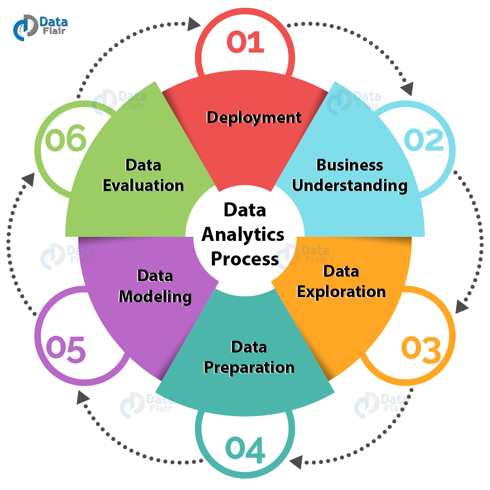

```{r setup, include=FALSE}
options(htmltools.dir.version = FALSE)
```

## General Information

- Office hours: MF 2-3, TuTh 12-3, and W 2-4
- *Project:* Enrolment and Admission at UE
- *Client:* Dr. Dave Dwyer
- *Deliverables:* Presentation and Project Report

---

## Course Schedule

- First few weeks: 
  - Data Analysis Workflow 
  - Tidyverse
  - R graphics with ggplot2 
  - Basic regression modeling.
- Following weeks: go wild with the project!!
- The last two weeks: Prepare and Present the project

---

## Real World Analysis Process

```{r, out.width='65%', fig.align='center', echo=FALSE}

```

---

## What we will do in this course 

```{r, out.width='100%', fig.align='center', echo=FALSE}
knitr::include_graphics('images/data-science.png')
```

--

.center[

### Why we should use R?

]

--

.center[ 

**Reproducible Data Analysis**

]


---

## Reproducible Data Analysis

- Data Analysis is replicable if independent analysts can easily use, replicate the results with the available data and code

- Benefits for the teams/others
  - Results are transparent
  - Reduces frustration and effort involved in replication

--

- Benefits for you
  - records what you did and why you did it
  - support rigorous thinking
  - facilitate future changes to your work
  
---

## R Markdown

- provides unifed framework for reproducible data analysis, combining your code, its results, and your prose commentary

- produces many output document formats, like PDF, Word files, slideshows, and more.
  - Use **notebook** format for majority of this course.

--

- In-class activities: 
  - Compare and contrast the R notebook and R markdown files.
  - Create one new R Markdown document for PDF and Word formats.

---

## R Markdown basics

- Text formatting with Markdown

--

- Code chunks
  - Chunk name
  - Chunk options

--

- Inline code
  - formatting  with `format()`
```{r}
comma <- function(x) format(x, digits = 2, big.mark = ",")
comma(364125)
comma(.236521489)
```

- In-class activity: Modify `diamonds-sizes.Rmd` to use `comma()` to produce nicely formatted output. 

---

# Tips on project workflow

- Dealing with paths and directories are a little frustrated
  - Mac/Linux and Windows use two different styles of paths
  - Never use absolute paths
  - Use RStudio projects

- Take advantage of the RStudio project
  - Isolate codes from different projects
  - Allow relative paths
  - keep data files there; preferably, under `data` folder
  - save your outputs (plots and cleaned data) there, but in different folders


