```{r setup, include=FALSE}
options(htmltools.dir.version = FALSE)
```

# Introduction

A typical data analysis project:

```{r, out.width='50%', fig.align='center', echo=FALSE}
knitr::include_graphics('images/data-science.png')
```

--

The `tidyverse` is an opinionated collection of R packages for each steps in data analysis.

```{r, out.width='50%', fig.align='center', echo=FALSE}
knitr::include_graphics('images/tidyverse.png')
```

---
# Tidyverse 

> Happy families are all alike; every unhappy family is unhappy in its own way. 

- *Hadley Wickham:* tidy datasets are all alike, but every messy dataset is messy in its own way.

--

In **tidy data:**

1. Each variable forms a column.

2. Each observation forms a row.

3. Each type of observational unit forms a table.

--

### How to tidy a messy data?

- Must be treated in a case by case basic

- Many packages in `tidyverse` help: `tidyr` (reshape the table), `stringr` (for strings), `lubridate` (for date/time), and `forcats` (for factors and categorical variables).

---
# Example - Flights data

- `flights [227,496 x 14].` Every flight departing Houston in 2011.

- `weather [8,723 x 14].` Hourly weather data.

- `planes [2,853 x 9].` Plane metadata.

- `airports [3,376 x 7].` Airport metadata.

--

<br/>
<br/>
*Brainstorming:* What questions might you want to answer with this data?
---
# One table verbs

- **filter:** keep rows matching criteria

- **select:** pick columns by name

- **arrange:** reorder rows

- **mutate:** add new variables

- **summarise:** reduce variables to values

---

# Structure

- First argument is a data frame (table)

- Subsequent arguments say what to do with data frame (table)

- Always return a data frame

- (Never modify in place)
---

```{r, out.width='100%', fig.align='center', echo=FALSE}
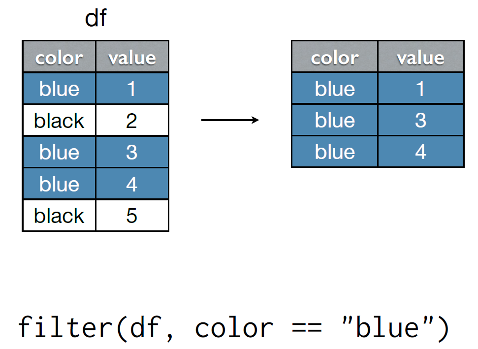
```
---

```{r, out.width='100%', fig.align='center', echo=FALSE}
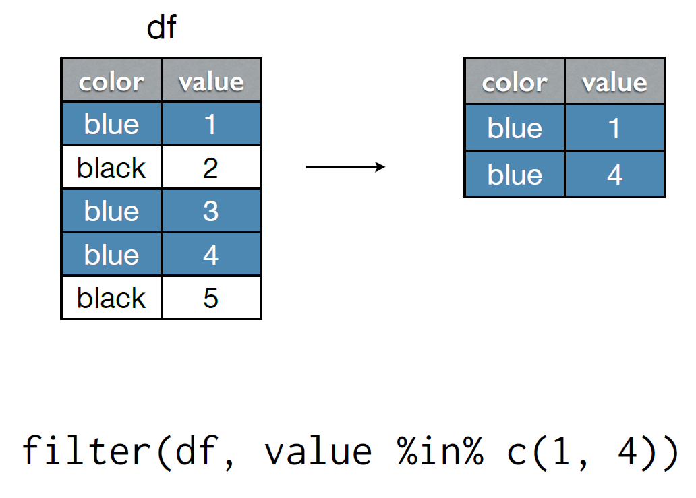
```
---

```{r, out.width='100%', fig.align='center', echo=FALSE}
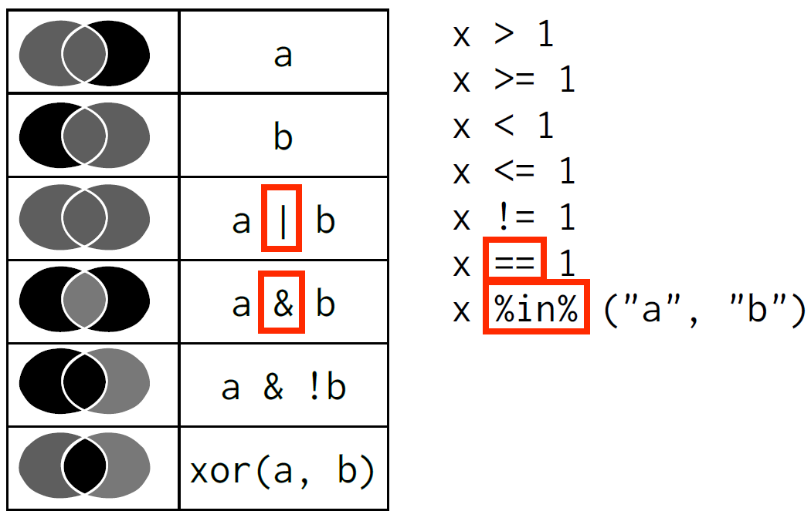
```
---
# Find all flights:

1. To SFO or OAK

2. In January

3. Delayed by more than an hour

4. That departed between midnight and 5 a.m.

5. Where the arrival delay was more than twice the departure delay

**How many flights are there for each question?**

---

```{r, out.width='100%', fig.align='center', echo=FALSE}
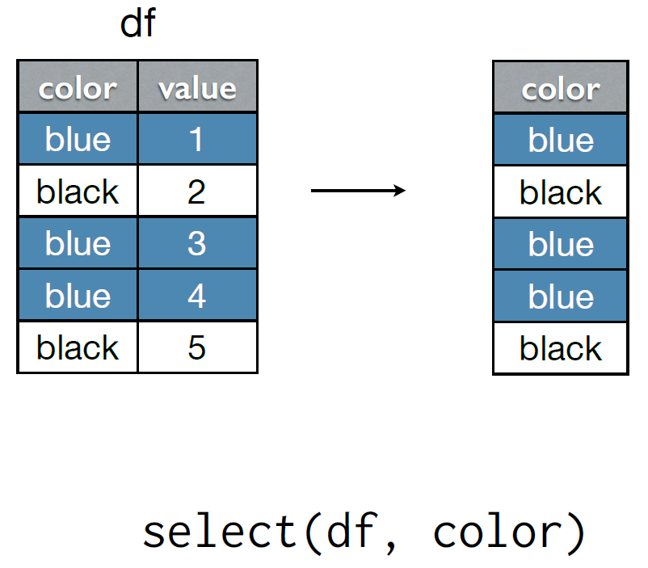
```
---

```{r, out.width='100%', fig.align='center', echo=FALSE}

```
---
# More on `select()`

- You can select a consecutive sequence of columns using `:` (colon) in the form of

.center[`<NAME OF FIRST SELECTED COLUMN>:<NAME OF LAST SELECTED COLUMN>`]

- Number of very useful functions that only work inside `select()`, like `starts_with()`, `ends_with()`, `contain()`, etc.

- Read the help for `select()` to see all available functions.
---

```{r, out.width='100%', fig.align='center', echo=FALSE}
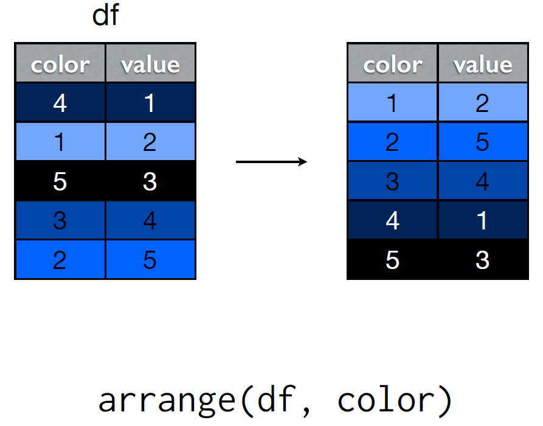
```
---

```{r, out.width='100%', fig.align='center', echo=FALSE}
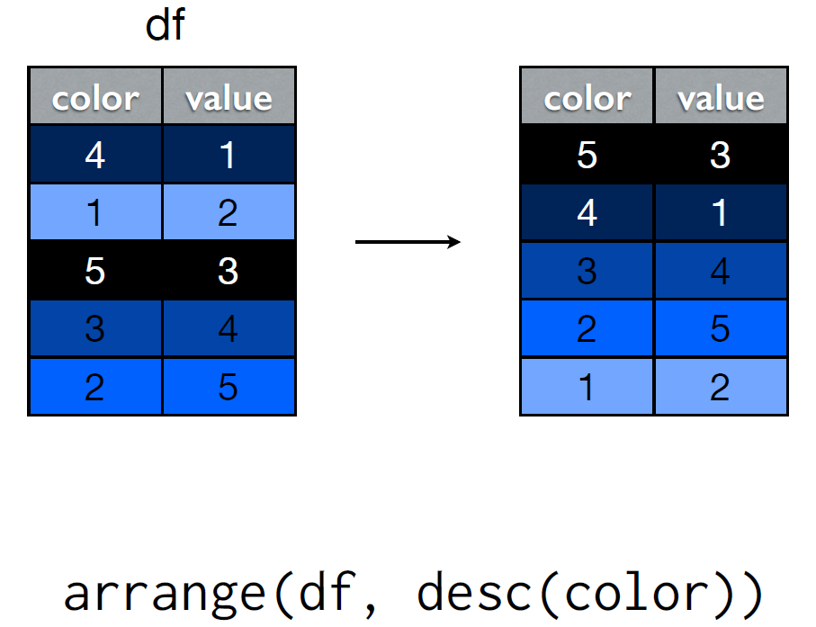
```
---
# Your turn

1. Which flights were most delayed?

2. Which flights caught up the most time during the flight?

---
```{r, out.width='100%', fig.align='center', echo=FALSE}
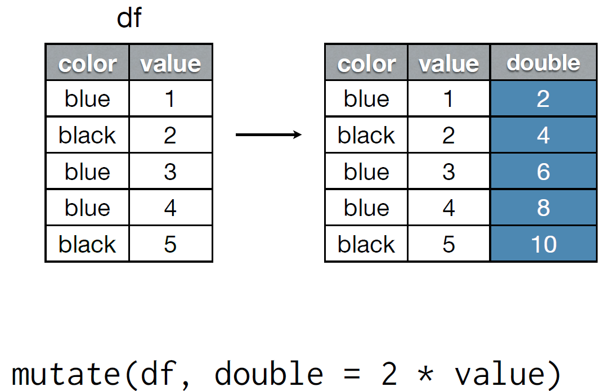
```
---

```{r, out.width='100%', fig.align='center', echo=FALSE}
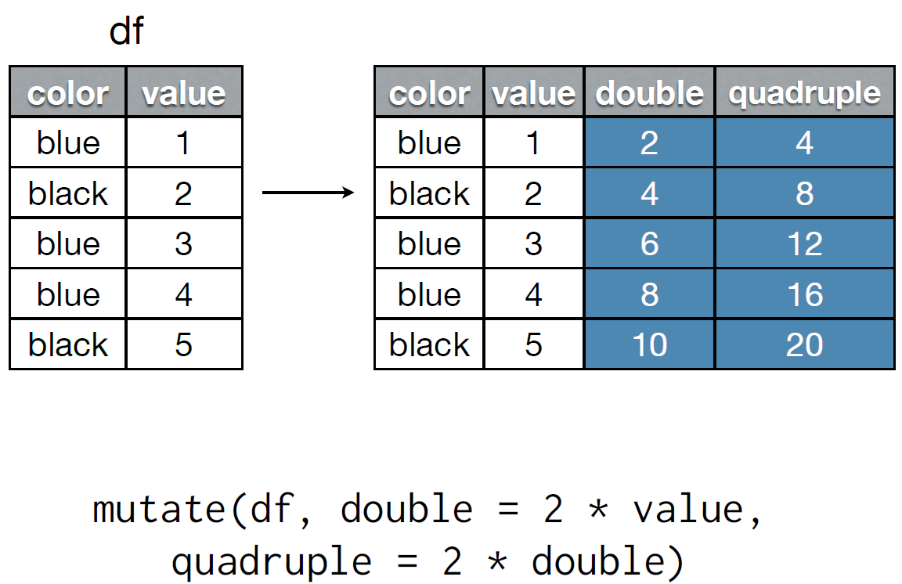
```
---
# Your turn

1. Add a new variable that shows how much time was made up or lost in flight

2. Compute speed in mph from time (in minutes) and distance (in miles). Which flight flew the fastest?

---
```{r, out.width='100%', fig.align='center', echo=FALSE}
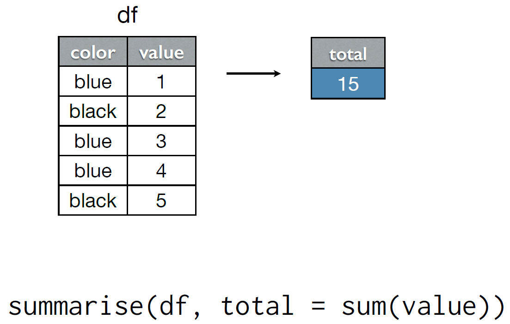
```
---

```{r, out.width='100%', fig.align='center', echo=FALSE}
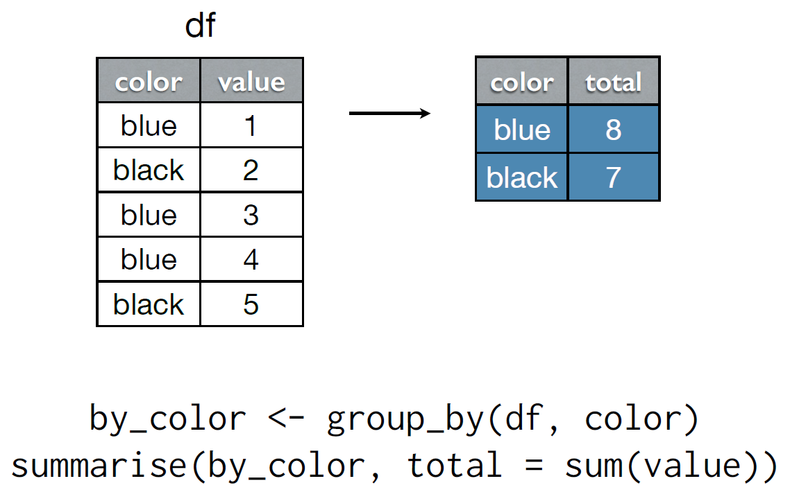
```
---
# Summary functions

- `min()`, `median()`, `max()`, `quantile(x, p)`

- `n()`, `n_distinct()`, `sum()`, `mean(x)`

- `sum(x > 10)`, `mean(x > 10)`

- `sd()`, `var()`, `iqr()`, `mad()`
---
# Your turn

How might you summarise `dep_delay` for each day?

---

# Data pipelines

- Functions in R behave similar to mathematical functions, especially for composition of functions. For example: the function $f(g(h(x)))$ must be evaluated inside out.

--

- Use pipe `%>%` in the package `magrittr`, part of the `tidyverse`: 

.center[ `x %>% h() %>% g() %>% f()` ]

- Mentally, read `%>%` as "then". 

- For example: Take $x$, then do $h$, then do $g$, then do $f$.

---
# Your turn

Crete data pipelines to answer the following questions:

1. Which destinations have the highest average delays?

2. Which flights (i.e., carrier + flight) happen every day? Where do they fly to?

---
# . - the placehoder

- What if the input should not be the first argument?

  - Use `.` as an argument placeholder.
  
  - Example: 

```
f(y, x)

x %>% f(y, .)
```
  - Placeholder says where the piped input should land
---
# Two table verbs

- How to join two tables (datasets)?

```{r, out.width='100%', fig.align='center', echo=FALSE}
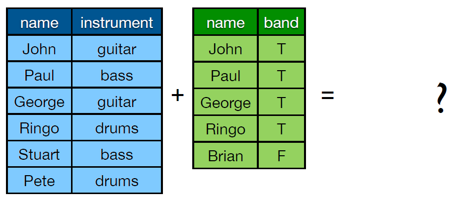
```

---

```{r, out.width='100%', fig.align='center', echo=FALSE}
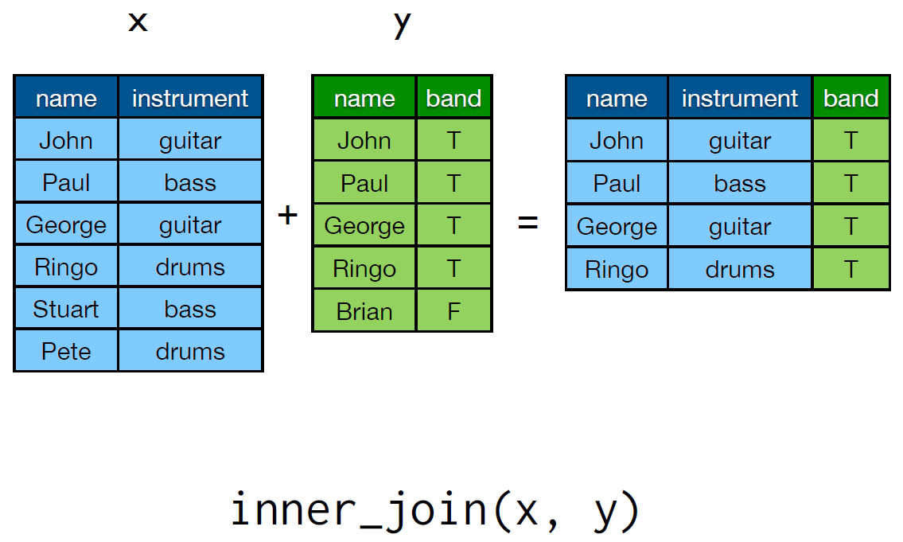
```

---
```{r, out.width='100%', fig.align='center', echo=FALSE}
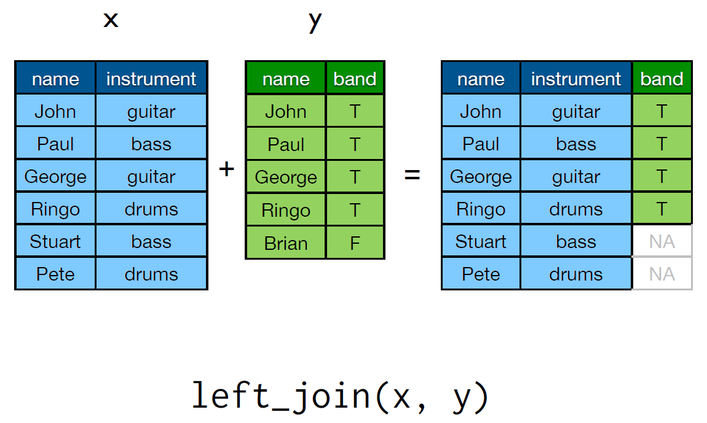
```

---
```{r, out.width='100%', fig.align='center', echo=FALSE}
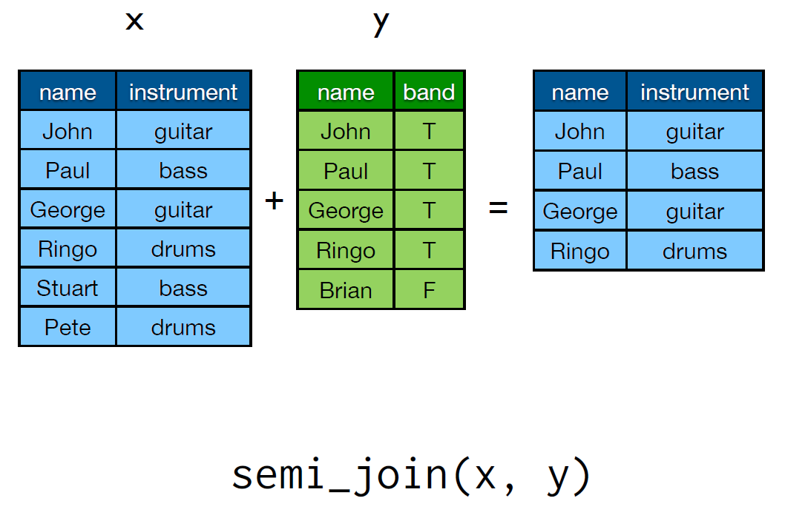
```

---
```{r, out.width='100%', fig.align='center', echo=FALSE}
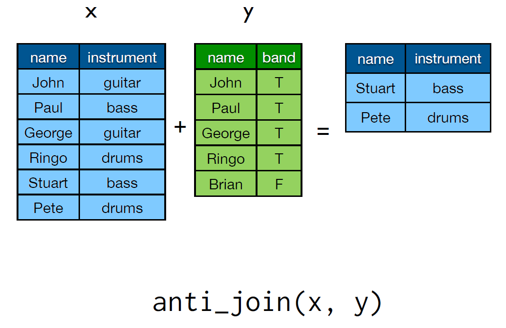
```

---
# Joining types

| Type | Action |
|------|--------|
| inner | Include only rows in **both** x and y |
| left | Include all of x, and matching rows of y |
| semi | Include rows of x that match y |
| anti | Include rows of x that **don’t** match y |

- All common named columns will be used as keys for matching.


---
# Your turn

```{r, eval=FALSE}
hourly_delay <- flights %>%
  group_by(date, hour) %>%
  filter(!is.na(dep_delay)) %>%
  summarise(
    delay = mean(dep_delay),
    n = n()
  ) %>%
  filter(n > 10)

delay_weather <- hourly_delay %>% left_join(weather)
```

What weather conditions are associated with delays leaving in Houston? Use graphics to explore.


